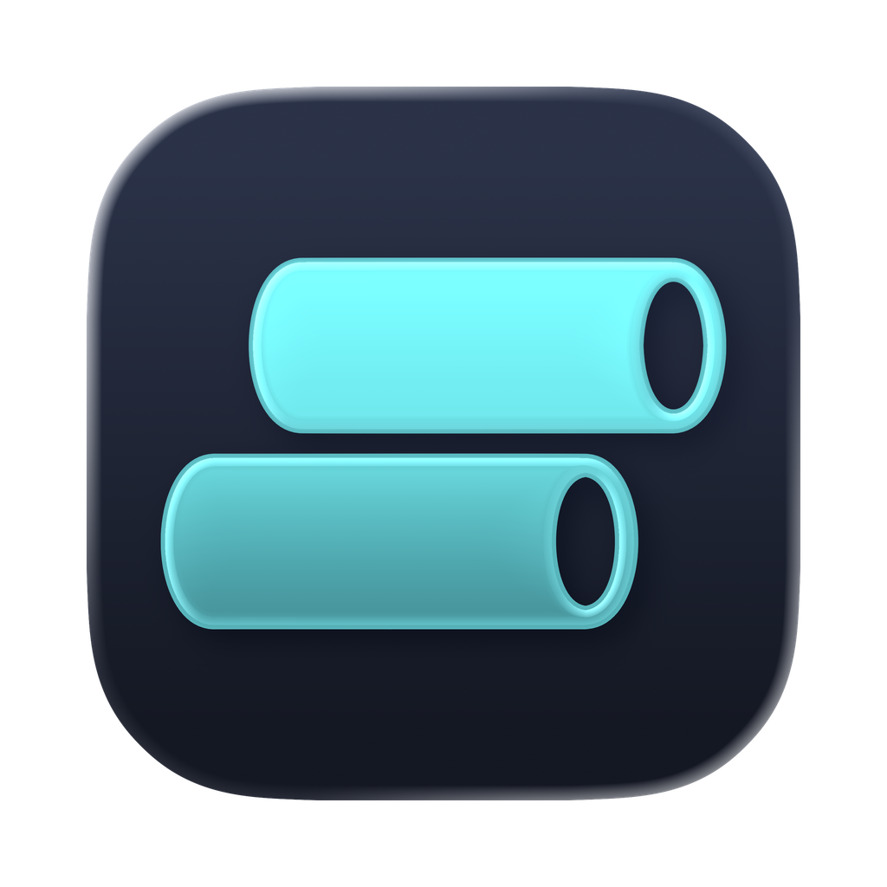

<div align="center">
    
    <h1>PTSBuilder</h1>
    <p>
        PTSBuilder is a fully cross-platform desktop 3D builder for pneumatic tube systems.
        <br>
        It supports part placement, obstacle volumes, auto-routing, validation, BOM review, and quote PDF export.
    </p>
    <a href="https://github.com/chriscorbell/PTSBuilder/releases/latest">
        Download
    </a>
</div>

## Tech Stack

- Electron, electron-vite, and electron-builder for the desktop app shell and packaging
- React 19 and TypeScript for the UI
- Three.js for the 3D viewport
- Vitest for automated tests
- pnpm for package management

## Development

Requires **Node 24** and **pnpm 11** (see `engines` in `package.json`; CI and the Electron runtime
both track Node 24).

```sh
pnpm install
pnpm dev             # run the app with hot reload
```

Quality gates, in the order CI runs them:

```sh
pnpm run format:check   # or `pnpm run format` to fix
pnpm run lint           # or `pnpm run lint:fix`
pnpm run typecheck
pnpm test
pnpm run check          # all four in one go
```

Packaging (writes installers to `release/`):

```sh
pnpm run build          # typecheck + electron-vite build
pnpm run package        # build + electron-builder
pnpm run package:dir    # unpacked directory, faster for smoke tests
```

`git blame` skips the bulk reformat listed in `.git-blame-ignore-revs`. GitHub applies it
automatically; locally, run `git config blame.ignoreRevsFile .git-blame-ignore-revs` once.

## Architecture

Four deliberately separated layers:

| Path | Contains |
|---|---|
| `src/domain/` | Pure logic: geometry, placement rules, topology, routing, validation, pricing, file format. No React, no Three.js. Most tests live here |
| `src/renderer/` | The Three.js viewport. Pure math is extracted into testable helpers; imperative scene-building lives in effects |
| `src/components/` | React UI |
| `electron/` | Main process and preload bridge |

**Read [`CONTEXT.md`](CONTEXT.md) before changing domain code.** It defines the vocabulary (design,
part, terminal, bend, cell, centerline, open port) and — critically — which numbers in this codebase
are authoritative engineering spec versus placeholder catalog data. The two look identical in
source. Decisions with lasting consequences are recorded in [`docs/adr/`](docs/adr).

## Controls

| Input | Action |
|---|---|
| Left-drag | Orbit · **Right-drag** pan · **Wheel** zoom |
| `V` / `O` / `X` | Select · Obstacle · Erase |
| `R` / `Shift`+`R` | Rotate the placement ghost |
| `[` / `]` | Lower / raise the placement elevation |
| `Esc` | Cancel the active tool |
| `Ctrl`/`Cmd`+`Z` | Undo (`Shift`+ to redo, or `Ctrl`+`Y`) |

## Releases

Pushing a `v*` tag builds and publishes installers for macOS, Windows, and Linux, then fills in the
release notes from the commit log. The tag drives the version — `package.json` is synced to it
during the build rather than bumped by hand.

Self-update works on Windows and Linux AppImage. macOS and non-AppImage Linux check GitHub and point
the user at the download page instead, because Squirrel.Mac requires a Developer ID signature that
this project does not currently have.
